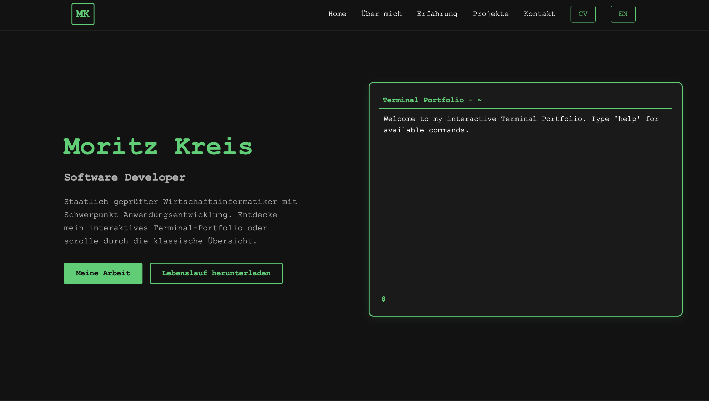

# Portfolio

> Interaktives, zweisprachiges Entwicklerportfolio von **Moritz Kreis**.
> Die Website verbindet eine klassische Portfolio-Navigation mit einem Terminal, über das Besucher Bereiche erkunden, Informationen abrufen und den Lebenslauf herunterladen können. Umgesetzt ist das Projekt als clientseitige Blazor-WebAssembly-Anwendung mit .NET 10.

[Live ansehen](https://pillipalli.github.io/portfolio/)

---

## ✨ Features

- Responsive Portfolio-Ansicht mit den Bereichen Über mich, Erfahrung, Projekte und Kontakt
- Interaktives Terminal mit Unix-ähnlichen Befehlen und Befehlshistorie
- Virtuelles Dateisystem zum Erkunden der Portfolio-Inhalte
- Umschaltung zwischen Deutsch und Englisch
- Lebenslauf-Download als deutsche oder englische PDF
- Zufällige Fun Facts über eine externe API
- Automatisches Deployment auf GitHub Pages

### Terminal-Befehle

| Befehl | Beschreibung |
|---|---|
| `help [befehl]` | Verfügbare Befehle oder Details zu einem Befehl anzeigen |
| `cd <bereich>` | Zu `about`, `experience`, `projects`, `contact` oder `home` navigieren |
| `ls` | Bereiche beziehungsweise Dateien im aktuellen Bereich auflisten |
| `cat <datei>` | Inhalt einer virtuellen Datei anzeigen |
| `pwd` | Aktuellen Bereichspfad ausgeben |
| `home` | Zur Startseite zurückkehren |
| `cv` | Lebenslauf in der aktiven Sprache herunterladen |
| `whoami` | Namen des Portfolio-Inhabers anzeigen |
| `date` | Aktuelles Datum und aktuelle Uhrzeit anzeigen |
| `funfact` | Zufälligen Fun Fact abrufen |
| `clear` | Terminalausgabe leeren |

---

## 🛠 Tech Stack

| Kategorie | Technologie |
|---|---|
| Framework | Blazor WebAssembly auf .NET 10 |
| Sprache | C# |
| UI | Razor Components, HTML5 und CSS3 |
| Browser-Integration | JavaScript Interop |
| Tests | xUnit und NSubstitute |
| Hosting | GitHub Pages |
| CI/CD | GitHub Actions |

---

## 🏗 Architektur

Die Anwendung läuft vollständig clientseitig als Blazor WebAssembly. Razor Components bilden die Benutzeroberfläche, während Services Navigation, Sprache und Terminalzustand verwalten. Terminalbefehle implementieren ein gemeinsames Command-Modell und greifen für navigierbare Inhalte auf ein virtuelles Dateisystem zu. Browserfunktionen wie Downloads werden über JavaScript Interop angebunden.

```text
Razor Components
├── Sections und Navigation
└── Terminal
    ├── CommandService
    ├── Commands
    ├── NavigationService
    ├── LanguageService
    └── VirtualFileSystem
```

---

## 📂 Projektstruktur

```text
Portfolio/
├── Portfolio/
│   ├── Components/              # Navigation, Portfolio-Bereiche und Karten
│   ├── Layout/                  # Gemeinsames Seitenlayout
│   ├── Models/
│   │   └── Commands/            # Implementierungen der Terminalbefehle
│   ├── Pages/                   # Start- und Fehlerseite
│   ├── Services/                # Navigation, Sprache, Terminal und Dateisystem
│   ├── wwwroot/
│   │   ├── css/                 # Globales Styling
│   │   ├── cv/                  # Lebensläufe auf Deutsch und Englisch
│   │   ├── images/              # Icons und Bilddateien
│   │   └── js/                  # JavaScript Interop
│   ├── Portfolio.csproj
│   └── Program.cs
├── Portfolio.Tests/             # Unit-Tests
└── Portfolio.sln
```

---

## 🚀 Installation

### Voraussetzungen

- [.NET 10 SDK](https://dotnet.microsoft.com/download/dotnet/10.0)
- Git

### Repository klonen

```bash
git clone https://github.com/PilliPalli/portfolio.git
cd portfolio
```

### Anwendung starten

```bash
dotnet run --project Portfolio/Portfolio/Portfolio.csproj
```

Anschließend ist die Anwendung standardmäßig unter `http://localhost:5143` erreichbar.

### Build und Tests

```bash
dotnet build Portfolio/Portfolio.sln
dotnet test Portfolio/Portfolio.sln
```

---

## ⚙ Konfiguration

Die Anwendung benötigt für den lokalen Start keine zusätzliche Konfiguration. Allgemeine Blazor-Einstellungen liegen in `Portfolio/Portfolio/wwwroot/appsettings.json`.

Ein Push auf `main` startet den GitHub-Actions-Workflow. Dieser veröffentlicht die Anwendung mit .NET 10 und deployt den Inhalt von `dist/wwwroot` auf den Branch `gh-pages`. Alternativ lässt sich das Deployment über `workflow_dispatch` manuell starten.

---

## 📸 Screenshots


